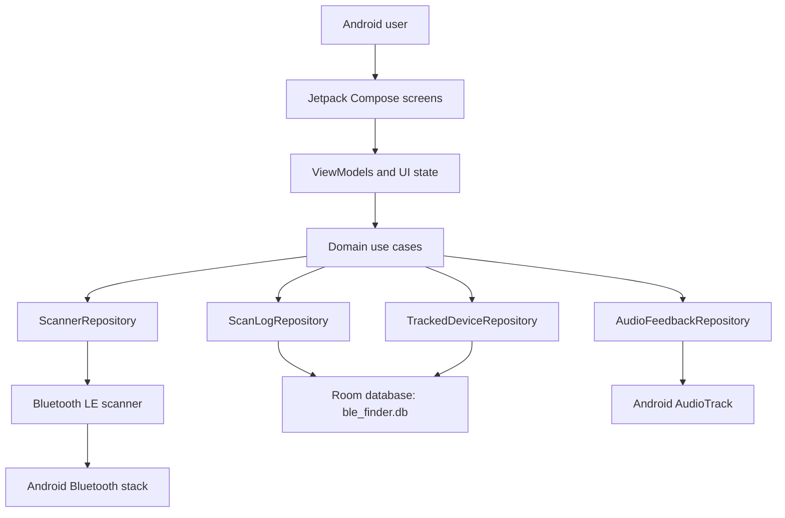

# BLE Finder

[](app/build.gradle.kts)
[](#license)
[](app/build.gradle.kts)
[](gradle/libs.versions.toml)
[](https://github.com/michaelsam94/BLE-Finder)
[](https://github.com/michaelsam94/BLE-Finder/issues)

BLE Finder is an Android app for finding nearby Bluetooth Low Energy devices by turning raw RSSI signal changes into a
radar-style tracking experience. It is built for people trying to locate wearables, earbuds, styluses, trackers, and
other BLE peripherals using visual hot/cold feedback and optional audio pings. No hosted demo is configured because the
primary artifact is a mobile app.

## Project Overview

The app scans nearby BLE advertisements, filters and sorts discovered devices, and lets the user focus on one target at a
time. It estimates proximity from RSSI, smooths noisy signal changes, keeps local scan logs in Room, and includes Play
Store-ready assets plus a separate privacy policy site for publication support.

## Key Features

- 📡 Low-latency BLE scanning with Android permission handling for modern Bluetooth APIs.
- 🎯 Radar tracking screen with RSSI-based hot, warm, and cold proximity states.
- 🔊 Optional audio ping feedback that changes frequency and interval as signal strength improves.
- 🧭 Device filtering and sorting by type, signal strength, advertised name, and last-seen time.
- 🗃️ Local Room database for tracked devices and scan-history logs.
- 🧹 Log retention controls with purge support for old scan entries.
- 🧪 JVM, Robolectric, Compose UI, and Roborazzi screenshot tests.
- 🛒 Generated Google Play graphics, phone screenshots, tablet screenshots, and listing copy.

## Architecture Overview



The project follows a lightweight clean-architecture layout. Compose screens render state and delegate actions to
ViewModels, ViewModels call domain use cases, and use cases depend on repository interfaces. Data implementations wrap
Android Bluetooth scanning, Room DAOs, and AudioTrack-based audio feedback.

Scan flow: the user grants Bluetooth/location permissions, `BleScanner` starts a low-latency BLE scan, scan results are
converted into `BleDevice` models, the UI filters/sorts them, and tracking screens calculate smoothed RSSI and estimated
distance for a selected MAC address.

Design patterns used here include repository interfaces, use-case classes, manual dependency injection through
`AppContainer`, Kotlin Flow for asynchronous scan streams, and immutable UI state collected by Compose.

## Tech Stack & Libraries

| Layer | Technology | Version | Purpose |
|---|---:|---:|---|
| Platform | Android SDK | min 24, target 36, compile 36.1 | Native BLE scanning app |
| Language | Kotlin | 2.2.10 | Application source and Gradle DSL |
| Build | Gradle Wrapper | 9.5.1 | Reproducible local builds |
| Build | Android Gradle Plugin | 9.1.1 | Android application packaging |
| UI | Jetpack Compose BOM | 2024.09.00 | Declarative Android UI |
| UI | Material 3 | BOM-managed | App components and theme |
| Navigation | Navigation Compose | 2.8.9 | Screen routing |
| Persistence | Room | 2.7.0 | Local database and DAOs |
| Async | Kotlin Coroutines | 1.10.2 | Flows, scanning, and background work |
| Audio | Android AudioTrack | Android framework | Proximity ping synthesis |
| Networking | OkHttp / Retrofit / Moshi | 4.10.0 / 2.12.0 / 1.15.2 | Available dependencies; no API client is currently wired |
| Testing | JUnit / Robolectric | 4.13.2 / 4.16.1 | Unit and Android resource tests |
| Screenshots | Roborazzi | 1.59.0 | Play Store screenshot and graphic generation |
| Secrets | Maps Platform Secrets Plugin | 2.0.1 | `.env` loading if future secrets are added |

## Prerequisites

- macOS, Linux, or Windows with Android Studio installed.
- JDK 17 or newer available to Gradle and Android Studio.
- Android SDK with API 36 installed.
- A physical Android device or emulator. BLE discovery is most useful on physical hardware with Bluetooth LE.
- Bluetooth and location permissions enabled on the test device.

| Variable | Required | Default | Description |
|---|---:|---|---|
| `KEYSTORE_PATH` | Release only | `BLEFinder/my-upload-key.jks` | Path to the release signing keystore. |
| `STORE_PASSWORD` | Release only | Not configured | Keystore password for `bundleRelease` or `assembleRelease`. |
| `KEY_PASSWORD` | Release only | Not configured | Upload key password for release signing. |
| `GEMINI_API_KEY` | No | Not configured | Mentioned by the old template, but no active app code uses it. |

## Installation & Setup

1. Clone the repository.

```bash
git clone https://github.com/michaelsam94/BLE-Finder.git
cd BLE-Finder
```

2. Confirm the Gradle wrapper is executable on macOS or Linux.

```bash
chmod +x ./gradlew
```

3. Install Android SDK API 36 from Android Studio if it is not already present.

4. Create an optional `.env` file only if you add secrets later. The current BLE app does not require runtime API keys.

```bash
touch .env
```

5. Build the debug app.

```bash
./gradlew assembleDebug
```

6. Install the debug build on a connected Android device.

```bash
adb install -r app/build/outputs/apk/debug/app-debug.apk
```

Database setup is automatic. Room creates `ble_finder.db` on first app launch.

## Configuration

Runtime settings are exposed in the app's Settings screen:

| Setting | Location | Restart required | Description |
|---|---|---:|---|
| Audio Proximity Ping | Settings screen | No | Enables or disables signal-based audio feedback. |
| Scan Mode Optimization | Settings screen | No | UI control for scan behavior tradeoffs. |
| Log Retention Period | Settings screen | No | Selects a retention window from 3 to 30 days. |
| Release signing | `app/build.gradle.kts` and environment variables | Build restart | Configures upload-key signing. |
| App identity | `app/build.gradle.kts` | Rebuild | Defines namespace, application ID, version code, and version name. |
| App display name | `app/src/main/res/values/strings.xml` | Rebuild | Sets the launcher label. |

## Usage / Quick Start

### Run From Android Studio

1. Open the `BLEFinder` folder in Android Studio.
2. Select a physical Android device with Bluetooth enabled.
3. Run the `app` configuration.
4. Grant Bluetooth and location permissions when prompted.
5. Tap **Scan Devices**, then choose a discovered peripheral to open the radar tracker.

### Run From The Terminal

```bash
cd BLEFinder
./gradlew assembleDebug
adb install -r app/build/outputs/apk/debug/app-debug.apk
adb shell monkey -p com.michael.blefinder 1
```

### Generate Play Store Assets

```bash
cd BLEFinder
./gradlew generatePlayStoreAssets
```

Generated assets are written to `play-store/`, including `app-icon-512.png`, `feature-graphic.png`, phone screenshots,
tablet screenshots, and listing copy.

## API Reference

Not applicable. BLE Finder is a local Android application and does not expose an HTTP API, CLI API, SDK, or server
endpoint. Retrofit, OkHttp, and Moshi are present as dependencies, but no repository evidence shows a configured network
API client.

## Project Structure

```text
.
├── app/
│   ├── build.gradle.kts                  # Android app module configuration
│   ├── proguard-rules.pro                # Release shrinker rules
│   └── src/
│       ├── androidTest/                  # Instrumented Android tests
│       ├── main/
│       │   ├── AndroidManifest.xml       # Permissions, launcher activity, BLE feature
│       │   ├── java/com/michael/blefinder/
│       │   │   ├── data/                 # Bluetooth, Room, repository implementations
│       │   │   ├── di/                   # Manual dependency container
│       │   │   ├── domain/               # Models, repository contracts, use cases
│       │   │   ├── presentation/         # Compose screens, navigation, ViewModels
│       │   │   └── ui/theme/             # Material theme tokens
│       │   └── res/                      # App resources, launcher icons, XML config
│       └── test/                         # JVM, Robolectric, Compose, Roborazzi tests
├── gradle/
│   ├── libs.versions.toml                # Dependency and plugin versions
│   └── wrapper/                          # Gradle wrapper files
├── play-store/                           # Generated store assets and listing copy
├── build.gradle.kts                      # Top-level Gradle plugins
├── gradle.properties                     # Gradle and Android build flags
├── settings.gradle.kts                   # Plugin repositories and included modules
└── metadata.json                         # App metadata used by generation tooling
```

## Testing

Run all JVM unit, Robolectric, and non-screenshot Compose tests:

```bash
./gradlew testDebugUnitTest
```

Run Android instrumented tests on a connected device or emulator:

```bash
./gradlew connectedDebugAndroidTest
```

Regenerate Roborazzi screenshots and Play Store graphics:

```bash
./gradlew generatePlayStoreAssets
```

Test files live under `app/src/test/java/com/michael/blefinder/` and
`app/src/androidTest/java/com/michael/blefinder/`. Existing names use `*Test.kt`, while Play Store screenshot tests are
grouped under `app/src/test/java/com/michael/blefinder/playstore/`.

Coverage reporting is not configured in the repository.

## Deployment

### Debug Deployment

Use Android Studio or install the Gradle-generated APK directly:

```bash
./gradlew assembleDebug
adb install -r app/build/outputs/apk/debug/app-debug.apk
```

### Release Build

Set signing credentials, then build the release APK or Android App Bundle:

```bash
export KEYSTORE_PATH="$PWD/my-upload-key.jks"
read -rsp "Store password: " STORE_PASSWORD && export STORE_PASSWORD
read -rsp "Key password: " KEY_PASSWORD && export KEY_PASSWORD

./gradlew assembleRelease
./gradlew bundleRelease
```

Release artifacts are generated under `app/build/outputs/`. Docker, docker-compose, and backend health checks are not
applicable because this repository builds a native Android app with no server component.

### Privacy Policy Site

The privacy policy lives in the sibling `../BLEFinder-pv/` project and is configured for Netlify static hosting.

```bash
cd ../BLEFinder-pv
python3 -m http.server 8080 --directory .
```

## Contributing

1. Fork the repository and create a short feature branch such as `feature/radar-tuning` or `fix/scan-permissions`.
2. Follow Conventional Commits, for example `feat: add tracked-device notes` or `fix: stop scanner on disposal`.
3. Keep UI changes covered by focused Compose or Robolectric tests when practical.
4. Run `./gradlew testDebugUnitTest` before opening a pull request.
5. For release or store-listing changes, regenerate and review `play-store/` assets.
6. Include screenshots for user-facing UI changes.

`./docs/CONTRIBUTING.md` is not configured yet.

## Roadmap

- [ ] Persist Settings screen values across app restarts.
- [ ] Add richer tracked-device detail notes and favorite management.
- [ ] Add export options for scan-history logs.
- [ ] Add optional calibration for RSSI-to-distance estimates by device type.
- [ ] Add CI for Gradle tests and screenshot verification.

## License

Not configured. No `LICENSE` or `COPYING` file is present in the repository.

Copyright © 2026 Michael Sam. All rights reserved unless a license is added.

## Acknowledgements & Credits

BLE Finder is built on Android Bluetooth LE APIs, Jetpack Compose, Material 3, Kotlin Coroutines, Room, Robolectric, and
Roborazzi. The Play Store asset workflow uses generated screenshots and listing materials stored under `play-store/`.
